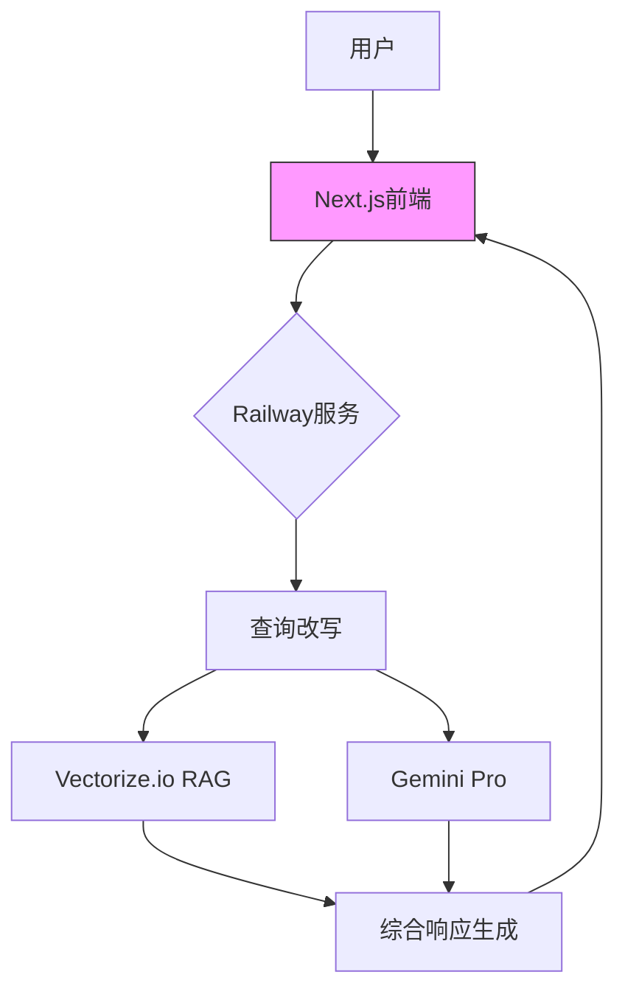
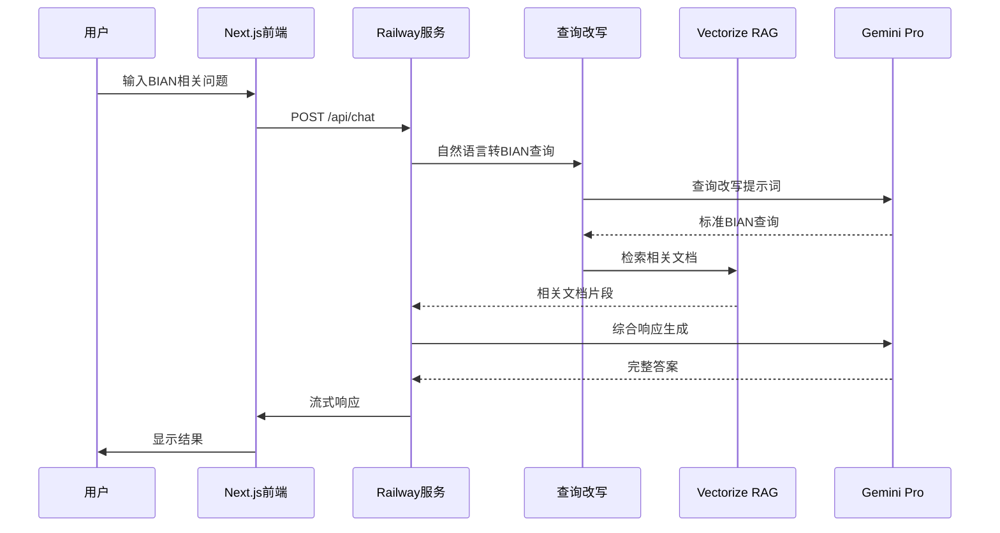
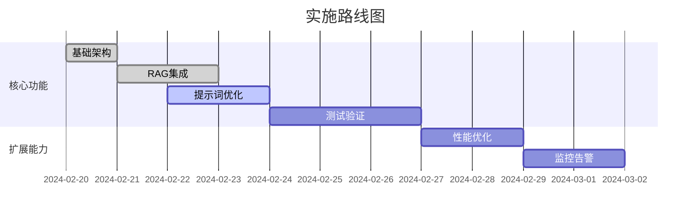

# AI_BIAN 智能问答系统

## 产品概述
AI_BIAN是一个基于Next.js 14开发的智能问答系统，专门针对BIAN（Banking Industry Architecture Network）框架提供专业解答。系统采用RAG（Retrieval-Augmented Generation）技术，结合Gemini Pro大语言模型，为用户提供准确、全面的BIAN相关知识。

## 架构设计


## 核心数据流


## 技术栈
| 组件 | 技术 | 用途 |
|------|------|------|
| 前端 | Next.js 14 (App Router) | 用户界面和交互 |
| 部署 | Railway | 应用托管和扩展 |
| 向量检索 | Vectorize.io | BIAN文档检索 |
| 大语言模型 | Google Gemini Pro | 查询改写和答案生成 |
| 提示词工程 | 结构化提示词模板 | 优化LLM输出质量 |

## 核心功能
1. **智能问答**：针对BIAN框架的专业问题提供准确回答
2. **查询改写**：将用户自然语言问题转换为BIAN专业查询
3. **文档检索**：从BIAN知识库中检索相关文档片段
4. **综合响应**：结合RAG结果和Gemini知识生成完整答案
5. **流式响应**：实时显示生成过程，提升用户体验

## 提示词工程
系统采用"角色-任务-要求-输出"的四位一体提示词工程模板，确保LLM输出的一致性和可控性：

### 查询改写提示词
```text
# ROLE
You are an expert query transformation assistant specializing in the BIAN domain.

# TASK
Transform the user's natural language question into a precise English query optimized for BIAN document retrieval.

# REQUIREMENTS
- Focus on key BIAN concepts, technical terms, Service Domains, or Service Operations
- Preserve the core semantic meaning and intent
- Remove conversational fillers and unnecessary context
- Output only the rewritten query string, with no preamble or explanation

# INPUT
Original User Question: "${originalUserQuestion}"

# OUTPUT
Output only the rewritten English query string.
```

### 综合响应生成提示词
```text
# ROLE
You are an expert assistant specializing in BIAN.

# TASK
Provide a comprehensive and accurate answer in English to the user's question.

# REQUIREMENTS
- Synthesize information from:
  1. Your internal knowledge base regarding BIAN
  2. The provided document excerpts
  3. Your general world knowledge for context
- Prioritize accuracy and depth
- Cite specific, relevant details from the excerpts when appropriate
- Respond in clear, professional English
- Structure the answer logically

# INPUT
User's Original Question: "${originalUserQuestion}"

Provided Document Excerpts:
<chunks>
${formattedDocuments}
</chunks>

# OUTPUT
Generate only the final answer in English to the user's question.
```

## 部署清单
```text
1. 前端部署: Railway静态托管
2. 服务文件: 
   ├─ src/app/api/chat/route.ts (API路由)
   ├─ src/app/page.tsx (前端页面)
   └─ src/app/layout.tsx (布局组件)
3. 环境变量:
   ├─ GEMINI_API_KEY
   ├─ VECTORIZE_API_KEY
   └─ VECTORIZE_INDEX_ID
```

## 演进路线


## 当前版本实现
✅ 基于Next.js 14的现代化前端
✅ RAG系统与Gemini Pro集成
✅ 结构化提示词工程
✅ 流式响应处理
✅ Railway部署支持

## 未来计划
1. 增加更多BIAN专业术语和概念的支持
2. 优化RAG检索算法，提高相关文档的匹配度
3. 实现用户反馈机制，持续改进系统性能
4. 添加多语言支持，扩大用户群体
5. 集成更多BIAN相关资源，丰富知识库

