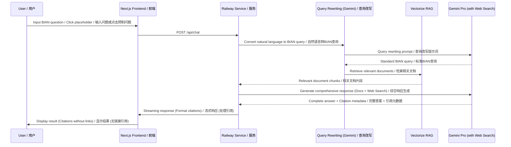
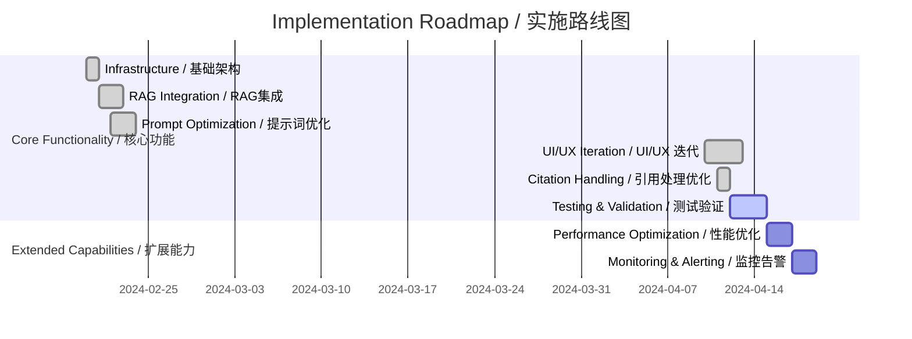

# AI_BIAN Intelligent Q&A System / 智能问答系统

## Product Overview / 产品概述

**English:**
AI_BIAN is an intelligent Q&A system developed with Next.js 14, specifically designed to provide professional answers about the BIAN (Banking Industry Architecture Network) framework. The system utilizes RAG (Retrieval-Augmented Generation) technology, combined with the Google Gemini Pro large language model and Web Search augmentation, drawing from knowledge sources like the BIAN 12.0 Service Landscape and the BIAN Book (2nd Edition) to offer users accurate and comprehensive BIAN-related knowledge.

**中文:**
AI_BIAN 是一个基于 Next.js 14 开发的智能问答系统，专门针对 BIAN（Banking Industry Architecture Network）框架提供专业解答。系统采用 RAG（Retrieval-Augmented Generation）技术，结合 Google Gemini Pro 大语言模型和 Web 搜索增强，基于 BIAN 12.0 Service Landscape 和 BIAN Book 第二版等知识源，为用户提供准确、全面的 BIAN 相关知识。

## Architecture Design / 架构设计
```mermaid
graph TD
    A[User / 用户] --> B[Next.js Frontend / 前端]
    B --> C{Railway Service / 服务}
    C --> D[Query Rewriting / 查询改写]
    D --> E[Vectorize.io RAG]
    D --> F[Gemini Pro (with Web Search)]
    E --> G[Response Generation / 综合响应生成]
    F --> G
    G --> B

    style B fill:#f9f,stroke:#333
```

## Core Data Flow / 核心数据流


## Technology Stack / 技术栈
| Component / 组件          | Technology / 技术                | Purpose / 用途                                   |
| ----------------------- | ---------------------------- | ---------------------------------------------- |
| Frontend / 前端           | Next.js 14 (App Router)      | User interface and interactions / 用户界面与交互 |
| Deployment / 部署         | Railway                      | Application hosting and scaling / 应用托管与扩展 |
| Vector Retrieval (RAG)  | Vectorize.io                 | BIAN document retrieval / BIAN 文档检索        |
| LLM / 大语言模型          | Google Gemini Pro            | Query rewriting, answer generation, Web Search augmentation / 查询改写、答案生成、Web搜索增强 |
| Prompt Engineering      | Structured Template          | Optimize LLM output quality / 优化LLM输出质量  |
| UI Library / UI 库      | Tailwind CSS, Lucide Icons   | Styling and icons / 页面样式与图标           |

## Core Features / 核心功能

**English:**
1.  **Intelligent Q&A**: Provides accurate answers to professional questions about the BIAN framework.
2.  **Query Rewriting**: Transforms user's natural language questions into optimized BIAN professional queries.
3.  **Document Retrieval**: Retrieves relevant document excerpts from the BIAN knowledge base (Service Landscape 12.0, BIAN Book, etc.).
4.  **Web Search Augmentation**: Utilizes Google Search to supplement answers with the latest information.
5.  **Comprehensive Response Generation**: Generates complete answers by combining RAG results, LLM internal knowledge, and Web Search findings.
6.  **Citation Generation & Formatting**: Automatically generates a reference list for BIAN documents and Web resources, optimized for clarity (title and number only, no links).
7.  **Streaming Response**: Displays the generation process in real-time for an enhanced user experience.
8.  **Placeholder Questions**: Offers a variety of pre-defined questions to guide user exploration.

**中文:**
1.  **智能问答**：针对 BIAN 框架的专业问题提供准确回答。
2.  **查询改写**：将用户自然语言问题转换为优化的 BIAN 专业查询。
3.  **文档检索**：从 BIAN 知识库 (Service Landscape 12.0, BIAN Book等) 中检索相关文档片段。
4.  **Web 搜索增强**：利用 Google Search 获取最新信息补充答案。
5.  **综合响应生成**：结合 RAG 结果、LLM 内部知识和 Web 搜索结果生成完整答案。
6.  **引用生成与格式化**：自动生成参考文献列表，包含 BIAN 文档和 Web 资源，并优化格式（仅标题和序号，无链接）。
7.  **流式响应**：实时显示生成过程，提升用户体验。
8.  **预制问题提示**: 提供多种预制问题，引导用户探索。

## UI/UX Design Highlights / UI/UX 设计亮点

**English:**
*   **Navbar Logo**: Combines a message bubble icon with "BIAN" text to reflect the application's theme.
*   **Hero Section**: Clearly displays the application name and slogan, highlighting core technologies and features (e.g., RAG+AI, BIAN 12.0, Web Search Augmentation) through info bubbles.
*   **Placeholder Questions**: Offers diverse, optimized pre-defined questions for easy user onboarding.
*   **About Modal**: Provides product overview, core features, and technology stack information in English.
*   **References**: Clearly lists cited BIAN document and Web resource titles (without links) at the end of answers for traceability.
*   **Dark Mode**: Supports automatic switching based on system settings or manual toggling.
*   **Responsive Design**: Adapts to different screen sizes.

**中文:**
*   **导航栏 Logo**: 结合了消息气泡图标和 "BIAN" 文字，体现应用主题。
*   **Hero区域**: 清晰展示应用名称、口号，并通过信息气泡突出核心技术和特性（如 RAG+AI, BIAN 12.0, Web Search Augmentation）。
*   **预制问题**: 提供多样化、经过优化的预制问题，方便用户快速开始。
*   **关于模态框**: 提供英文的产品概述、核心功能和技术栈信息。
*   **参考文献**: 在答案末尾清晰列出引用的 BIAN 文档和 Web 资源标题（无链接），便于溯源。
*   **暗黑模式**: 支持根据系统设置自动切换或手动切换暗黑模式。
*   **响应式设计**: 适应不同屏幕尺寸。

## Prompt Engineering / 提示词工程

**(Note: Prompts are in English / 提示词使用英文)**

The system uses a "Role-Task-Requirements-Output" template for prompt engineering to ensure LLM output consistency and control:
系统采用"角色-任务-要求-输出"的四位一体提示词工程模板，确保LLM输出的一致性和可控性：

### Query Rewriting Prompt / 查询改写提示词
```text
# ROLE
You are an expert query transformation assistant specializing in the BIAN domain.

# TASK
Transform the user's natural language question into a precise English query optimized for BIAN document retrieval.

# REQUIREMENTS
- Focus on key BIAN concepts, technical terms, Service Domains, or Service Operations
- Preserve the core semantic meaning and intent
- Remove conversational fillers and unnecessary context
- Output only the rewritten query string, with no preamble or explanation

# INPUT
Original User Question: "${originalUserQuestion}"

# OUTPUT
Output only the rewritten English query string.
```

### Comprehensive Response Generation Prompt (with Web Search) / 综合响应生成提示词 (已集成Web Search)
```text
# ROLE
You are an expert BIAN (Banking Industry Architecture Network) specialist with deep knowledge of banking architectures and financial technology standards.

# TASK
Provide a comprehensive, accurate, and professional answer about BIAN, covering frameworks, service domains, implementation methods, and related aspects.

# REQUIREMENTS
- Synthesize information from:
  1. Your internal BIAN knowledge base
  2. The provided document excerpts 
  3. Latest information obtained through Google search
- Prioritize accuracy and professionalism
- Always use proper citations when referencing information:
  - For BIAN documents: use [Doc#] format (Note: Output format removes links)
  - For web references: use appropriate citations (Note: Output format removes links)
- Structure your answer with clear headings, lists, and tables for improved readability
- Include relevant examples where appropriate
- Provide a concise but comprehensive answer in English
- Use web search to find answers if you're uncertain or need more information

# INPUT
User's Original Question: "${originalUserQuestion}"

Provided Document Excerpts:
<chunks>
${formattedDocuments}
</chunks>

# OUTPUT
Generate a comprehensive and authoritative BIAN-related answer, with appropriate citations to reliable sources. Use web search for additional information when needed.
```

## Deployment Checklist / 部署清单
```text
1. Frontend Deployment: Railway Static Hosting / 前端部署: Railway 静态托管
2. Service Files / 服务文件: 
   ├─ src/app/api/chat/route.ts (API Route, RAG, Citation Handling / API路由, RAG, 引用处理)
   ├─ src/app/page.tsx (Frontend Page, UI Components, useChat Hook / 前端页面, UI组件, useChat钩子)
   └─ src/app/layout.tsx (Root Layout Component / 根布局组件)
3. Environment Variables / 环境变量:
   ├─ GEMINI_API_KEY (Google AI Studio API Key)
   ├─ VECTORIZE_TOKEN (Vectorize.io API Key)
   ├─ VECTORIZE_RETRIEVAL_URL (Vectorize.io RAG Pipeline URL)
   └─ MODEL (Gemini model name used, e.g., gemini-1.5-flash-latest / 使用的 Gemini 模型名称)
```

## Evolution Roadmap / 演进路线


## Current Version Implementation (as of 2024-04-12) / 当前版本实现

**English:**
✅ Modern frontend based on Next.js 14, featuring a dynamic logo and extensive placeholder question prompts.
✅ RAG system integrated with Gemini Pro, supporting Web Search augmentation, with knowledge based on BIAN 12.0.
✅ Structured prompt engineering optimizing query rewriting and answer generation.
✅ Optimized citation handling and formatting (prioritizing metadata titles, removing links).
✅ Streaming response handling for improved user experience.
✅ Railway deployment support.
✅ Light/Dark mode support.
✅ English "About" information modal.
✅ Fixed placeholder question submission logic.

**中文:**
✅ 基于Next.js 14的现代化前端，包含动态Logo和丰富的预制问题提示。
✅ RAG系统与Gemini Pro集成，支持Web搜索增强，知识基于BIAN 12.0。
✅ 结构化提示词工程，优化查询改写和答案生成。
✅ 优化了引用处理和格式（优先使用元数据标题，移除链接）。
✅ 流式响应处理，提升用户体验。
✅ Railway部署支持。
✅ 支持亮/暗模式切换。
✅ 提供英文的"关于"信息模态框。
✅ 修复了预制问题提交逻辑。

## Future Plans / 未来计划

**English:**
1.  Expand support for more BIAN terminology and concepts.
2.  Optimize the RAG retrieval algorithm for better relevance matching.
3.  Implement a user feedback mechanism for continuous improvement.
4.  Add multi-language support (UI and responses).
5.  Integrate more BIAN-related resources to enrich the knowledge base.
6.  Explore advanced Gemini features (e.g., Function Calling).
7.  Enhance error handling and user guidance.

**中文:**
1.  增加更多BIAN专业术语和概念的支持。
2.  优化RAG检索算法，提高相关文档的匹配度。
3.  实现用户反馈机制，持续改进系统性能。
4.  添加多语言支持（UI和回答内容）。
5.  集成更多BIAN相关资源，丰富知识库。
6.  探索更高级的Gemini功能（如Function Calling）。
7.  增加详细的错误处理和用户指引。

