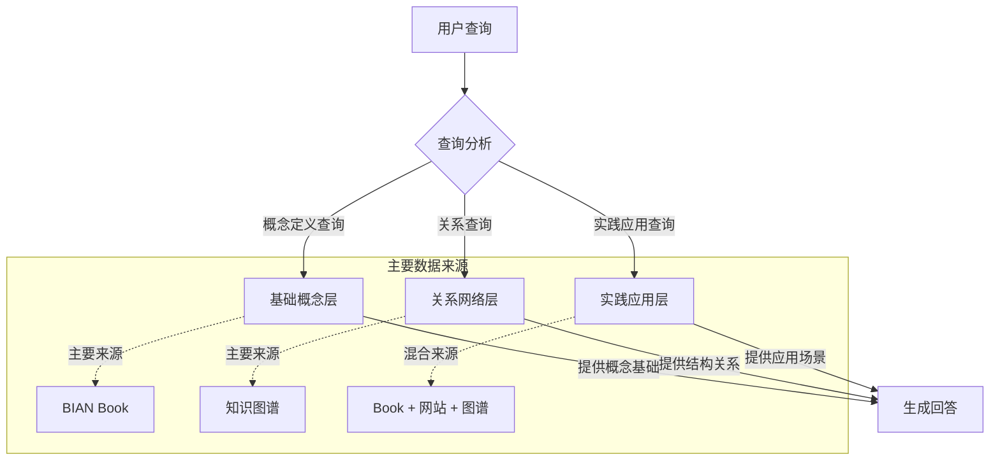

# 知识图谱RAG模块 PRD (BIAN GraphRAG) - v1.0

**版本:** 1.0 (初始设计版本)
**日期:** 2025年5月15日

---

## 1. 模块概述与目标

本模块是 BIAN 知识库项目的新增组件，作为现有双RAG+Web Grounding架构的补充，旨在提供结构化知识图谱查询能力。通过构建BIAN领域知识图谱、实现Text2Cypher转换和子图检索，为复杂的结构化查询提供更精准的答案，特别是处理实体关系类问题时具有显著优势。

**关键目标:**

* **核心功能:** 实现基于BIAN领域本体的知识图谱构建、查询和推理
* **查询增强:** 通过图结构捕获BIAN服务域间复杂关系，提供传统向量检索难以处理的结构化答案
* **三重RAG协同:** 与现有文本RAG和图表RAG形成互补，构建更全面的知识检索体系
* **接口设计:** 提供与主聊天后端（route.ts）无缝集成的API接口
* **技术选型:** 采用NebulaGraph作为图数据库，结合LlamaIndex的知识图谱工具

---

## 2. 架构设计 

本模块作为三重RAG架构中的知识图谱路径，在主聊天应用的流程中被调用。

```mermaid
graph TD
    subgraph "用户交互"
        User[用户] --> UI[Next.js前端]
    end
    
    subgraph "主聊天后端 (route.ts)"
        UI --> B[查询接收与处理]
        B --> C[查询改写 (Gemini)]
        C --> D{查询路由决策}
        
        D -->|文本知识| E[文本RAG (Vectorize)]
        D -->|结构化关系| F[GraphRAG 调用]
        D -->|实时信息| G[Web搜索 (Gemini)]
        D -->|图表需求| H[图表RAG]
        
        E --> I[响应融合与生成]
        F --> I
        G --> I
        H --> I
        
        I --> UI
    end
    
    subgraph "知识图谱RAG模块 (graphRAG)"
        F --> J[Text2Cypher转换]
        J --> K[(NebulaGraph 图数据库)]
        K --> L[子图结构化处理]
        L --> F
    end
    
    style F fill:#f9f,stroke:#333,stroke-width:2px
    style K fill:#ccf,stroke:#333,stroke-width:2px
```

**核心流程:**

1. **主聊天后端处理流程:**
   * 接收用户自然语言问题
   * 使用Gemini进行查询改写和类型分析
   * 根据问题类型路由至不同RAG路径
   * 并行调用适用的RAG路径（可能是部分或全部）
   * 收集各路径结果并进行融合
   * 生成最终答案并返回

2. **知识图谱RAG模块职责:**
   * 接收结构化查询请求
   * 使用LLM将自然语言转换为Cypher图查询
   * 执行图数据库查询并获取相关子图
   * 将子图数据格式化为结构化JSON
   * 返回结构化关系数据给主后端

---

## 3. API接口定义

### 3.1 主要端点

**端点:** `POST /api/graph-query`

**请求 (Request Body):**

```json
{
  "query": "联络中心管理与哪些服务域直接交互?", 
  "originalQuery": "告诉我联络中心管理服务域的上下游关系",
  "queryType": "relationship", 
  "entities": ["联络中心管理"], 
  "maxHops": 2,
  "limit": 10,
  "includeMetadata": true
}
```

**参数说明:**
* `query`: 经过改写的查询文本（必需）
* `originalQuery`: 原始用户查询（可选）
* `queryType`: 查询类型标识，可选值：relationship/definition/listing/comparison（可选）
* `entities`: 主实体名称数组（可选）
* `maxHops`: 最大关系跳数，默认为1（可选）
* `limit`: 返回结果数量限制，默认为5（可选）
* `includeMetadata`: 是否包含详细元数据，默认为true（可选）

**响应 (Response Body - 成功):**

```json
{
  "status": "success",
  "data": {
    "nodes": [
      {
        "id": "node1",
        "type": "ServiceDomain",
        "name": "联络中心管理",
        "properties": { 
          "description": "...",
          "category": "交互"
        }
      },
      {
        "id": "node2", 
        "type": "ServiceDomain",
        "name": "客户数据管理",
        "properties": { ... }
      }
    ],
    "relationships": [
      {
        "source": "node1",
        "target": "node2",
        "type": "INTERACTS_WITH",
        "properties": {
          "description": "通过获取客户信息进行交互",
          "direction": "outgoing"
        }
      }
    ],
    "metadata": {
      "queryTime": "10ms",
      "nodeCount": 5,
      "relationshipCount": 4
    }
  }
}
```

**响应 (Response Body - 失败):**

```json
{
  "status": "error",
  "error": {
    "code": "GRAPH_QUERY_ERROR",
    "message": "无法在知识图谱中找到实体: XYZ服务域"
  }
}
```

### 3.2 辅助端点

**健康检查:** `GET /api/graph-query/health`
**图谱统计:** `GET /api/graph-query/stats`

---

## 4. 与route.ts集成方案

为将GraphRAG模块整合至现有架构，需要在route.ts中进行以下修改：

### 4.1 查询类型分析

在查询改写步骤后，添加查询类型分析逻辑：

```typescript
// 添加到现有流程中 - 查询类型分析
const queryTypePrompt = `
# ROLE
You are a query type classifier for BIAN banking architecture questions.

# TASK
Analyze the question and classify it into one of the following types:
1. relationship - Questions about how entities connect or interact
2. definition - Questions asking for explanations/definitions
3. listing - Questions asking for listings/enumerations
4. comparison - Questions comparing multiple concepts
5. other - General questions that don't fit above categories

# INPUT
Query: "${rewrittenQuery}"

# OUTPUT
Return ONLY a JSON object with the following structure. NO extra text.
{
  "queryType": "relationship|definition|listing|comparison|other",
  "entities": ["Entity1", "Entity2"],
  "needsGraphQuery": true|false,
  "reasoning": "Brief explanation"
}
`;

const typeAnalysisResult = await generativeModel.generateContent(queryTypePrompt);
const queryAnalysis = JSON.parse(typeAnalysisResult.response.text());
```

### 4.2 条件性GraphRAG调用

基于查询分析结果，决定是否调用GraphRAG：

```typescript
// 条件性调用GraphRAG
let graphQueryResults = null;
if (queryAnalysis.needsGraphQuery) {
  try {
    graphQueryResults = await callGraphRAG({
      query: rewrittenQuery,
      originalQuery: originalUserQuestion,
      queryType: queryAnalysis.queryType,
      entities: queryAnalysis.entities,
      maxHops: queryAnalysis.queryType === "relationship" ? 2 : 1,
      limit: 10
    });
    console.log(`图谱查询成功，返回 ${graphQueryResults.data.nodes.length} 个节点和 ${graphQueryResults.data.relationships.length} 个关系`);
  } catch (graphError) {
    console.error("图谱查询失败:", graphError);
    // 错误处理但继续流程
  }
}
```

### 4.3 响应融合增强

在初步答案生成步骤添加图谱数据：

```typescript
// 准备包含图谱数据的提示词
const initialAnswerPrompt = `
# ROLE
You are an expert BIAN specialist with deep knowledge of banking architectures.

# TASK
Provide a comprehensive answer about BIAN, incorporating document excerpts, 
${graphQueryResults ? 'relationship data from the knowledge graph,' : ''} 
and web search results.

# INPUT
User's Original Question: "${originalUserQuestion}"

${formattedDocuments ? `Provided Document Excerpts:
<chunks>
${formattedDocuments}
</chunks>` : ''}

${graphQueryResults ? `Knowledge Graph Data:
<graph-data>
${JSON.stringify(graphQueryResults.data, null, 2)}
</graph-data>` : ''}

# OUTPUT
Generate a comprehensive BIAN answer, citing all used sources appropriately.
`;
```

---

## 5. 知识图谱构建

### 5.1 数据源与领域本体

主要数据来源：
* BIAN Service Landscape 12.0 文档
* BIAN网站服务域详情页面 
* 服务域关系SVG图表
* BIAN专家输入的核心关系

领域本体设计：
* **实体类型**: ServiceDomain, BusinessObject, ControlRecord, ServiceOperation
* **关系类型**: AGGREGATED_BY, ASSOCIATED_WITH, GETS_INPUT_FROM, IS_PART_OF, REALIZED_BY, MANAGES, PROVIDES

### 5.2 三元组提取与存储

采用混合方式构建：
1. **自动提取**: 使用LLM从BIAN文档和网站内容中提取三元组
2. **图表分析**: 从SVG图表中解析服务域关系
3. **手动补充**: 添加核心概念和关键关系
4. **三元组验证**: 使用规则和LLM验证提取的三元组质量
5. **图数据库存储**: 使用NebulaGraph存储和管理三元组

示例三元组：
```
(联络中心管理, MANAGES, 客户互动)
(联络中心管理, ASSOCIATED_WITH, 客户数据管理)
(客户互动, HAS_CONTROL_RECORD, 互动记录)
```

---

## 6. 技术栈选型

| 组件 | 技术选择 | 理由 |
|-----|---------|-----|
| 图数据库 | NebulaGraph | 开源、高性能、符合BIAN复杂关系建模需求 |
| 三元组提取 | LlamaIndex + 自定义提示模板 | 良好的LLM集成，专为知识提取优化 |
| Text2Cypher | Gemini Pro + 特定提示工程 | 高质量自然语言到图查询转换 |
| API服务 | FastAPI | 高性能异步处理，易于与主系统集成 |
| 部署 | Railway (与主系统同部署) | 简化基础设施管理，降低延迟 |

---

## 7. 实施路线图

1. **阶段一：基础知识图谱构建 (当前)**
   * BIAN服务域实体及核心关系构建
   * 基础API设计与开发
   * 与route.ts的初步集成

2. **阶段二：查询增强与优化**
   * 实现更复杂的查询转换能力
   * 添加多跳查询和路径分析
   * 优化查询路由和结果融合

3. **阶段三：高级特性**
   * 添加推理能力
   * 实现图谱可视化接口
   * 开发半自动图谱扩展机制

---

## 8. 性能与集成考虑

* **延迟控制**: 图查询响应时间目标 < 500ms
* **错误处理**: 实现图谱查询失败时的平滑降级机制
* **缓存策略**: 常见实体和关系查询结果缓存
* **并行处理**: 确保与其他RAG路径并行执行不产生阻塞
* **资源估计**: 初期图谱规模约 1000 节点, 3000 关系
* **扩展性**: 设计支持图谱持续增长和复杂度提升

---

## 9. 成功标准

* **准确性**: 关系类查询的准确率提升 20%+
* **覆盖率**: 涵盖 BIAN 12.0 中全部服务域及其关键关系
* **性能**: 95% 的查询响应时间 < 1 秒
* **结果质量**: 通过 A/B 测试证明知识图谱增强显著提升用户满意度
* **集成度**: 与现有RAG系统的无缝协作，提供统一的用户体验

---

## 10. BIAN Book与网站知识源整合方案

为了全面把握BIAN框架知识，本系统将整合两个核心知识源：BIAN Book（2nd Edition）的深度概念解释和BIAN网站的最新实践指南。这种整合将为GraphRAG提供更丰富的语义基础。

### 10.1 知识源特性对比

| 特性 | BIAN Book 2nd Edition | BIAN 官方网站 |
|-----|----------------------|--------------|
| 内容性质 | 权威理论基础、概念框架 | 最新实践指南、服务域详情 |
| 结构特点 | 系统化学术解释、标准定义 | 关系可视化、实现示例 |
| 更新频率 | 版本发布（低频率） | 持续更新（高频率） |
| 知识深度 | 深度概念解释（如功能模式、行为限定符） | 广度关系网络 |
| 信息形式 | 文本段落、概念图表 | HTML页面、SVG图表、API定义 |

### 10.2 三层知识整合模型

构建层次化知识模型，融合两种来源的优势：



**层次说明:**
1. **基础概念层**: 主要从BIAN Book提取，包含服务域正式定义、功能模式和行为限定符等标准术语
2. **关系网络层**: 主要从网站SVG和知识图谱提取，呈现服务域间的交互关系和依赖
3. **实践应用层**: 两种来源融合，连接理论概念与实际应用

### 10.3 知识标注与映射实现

为在知识图谱中整合BIAN Book的深度内容，采用以下标注策略：

1. **概念属性增强**:
   ```cypher
   CREATE TAG ServiceDomainAttributes (
       book_definition TEXT,      // BIAN Book中的正式定义
       functional_pattern TEXT,   // 功能模式
       behavior_qualifier TEXT,   // 行为限定符
       source TEXT                // 数据来源（"Book" 或 "Website"）
   )
   ```

2. **同义词网络**:
   建立Book与网站间的术语映射表，如：
   ```json
   {
     "CurrentAccountArrangment": ["CurrentAccountArrangement", "Current Account Control Record"],
     "FunctionalPattern:Fulfill": ["Functional Pattern Fulfill", "履行功能模式"]
   }
   ```

3. **引用关系类型**:
   ```cypher
   CREATE EDGE DEFINED_IN (page INT, section TEXT)  // 连接实体与Book中的定义
   CREATE EDGE ILLUSTRATED_BY (figure INT)         // 连接实体与Book中的图表
   ```

### 10.4 查询处理与融合逻辑

根据查询类型智能路由至最适合的知识源组合：

```python
def route_query(query_type, entities):
    if query_type == "definition":
        # 定义类查询优先使用Book知识
        return {
            "rag_priority": "textRAG",  # 优先文本RAG
            "book_weight": 0.7,         # 较高权重
            "graph_weight": 0.3,        # 较低权重
            "web_weight": 0.2           # 最低权重
        }
    elif query_type == "relationship":
        # 关系类查询优先使用图谱知识
        return {
            "rag_priority": "graphRAG", # 优先图谱RAG
            "book_weight": 0.3,         # 较低权重
            "graph_weight": 0.7,        # 较高权重
            "web_weight": 0.3           # 较低权重
        }
    elif query_type == "implementation":
        # 实现类查询优先使用网站和Web搜索
        return {
            "rag_priority": "hybridRAG", # 混合RAG
            "book_weight": 0.3,          # 中等权重
            "graph_weight": 0.4,         # 中等权重
            "web_weight": 0.6            # 较高权重
        }
    # 更多查询类型...
```

### 10.5 具体整合示例

以截图中的"Current Account服务域"为例：

1. **从Book提取**:
   - 功能模式"Fulfill"的正式定义
   - 控制记录"CurrentAccountArrangment"的结构说明
   - "AnalyticsObject"的概念解释

2. **从网站提取**:
   - 最新的服务域实现指南
   - Current Account与其他服务域的交互关系
   - 相关API端点和服务操作

3. **知识图谱表示**:
   ```cypher
   // 创建服务域节点
   CREATE (ca:ServiceDomain {name:"Current Account"})

   // 添加Book来源的属性
   SET ca.book_definition = "The Service Domain is the result of the Functional Pattern 'Fulfill', applied to the Asset Type 'Current Account'..."
   SET ca.functional_pattern = "Fulfill"
   SET ca.asset_type = "Current Account"
   
   // 添加控制记录关系
   CREATE (cr:ControlRecord {name:"CurrentAccountArrangment"})
   CREATE (ca)-[:HAS_CONTROL_RECORD]->(cr)
   
   // 添加分析对象
   CREATE (ao:AnalyticsObject {name:"CurrentAccountArrangment_AnalyticsObject"})
   CREATE (ca)-[:PROVIDES]->(ao)
   
   // 添加Book引用
   CREATE (ca)-[:DEFINED_IN {page:69, section:"2.8"}]->(:BookReference {title:"BIAN Book 2nd Edition"})
   ```

### 10.6 查询融合示例提示词

响应融合时，针对不同知识源的整合提示：

```typescript
// Book定义与图谱关系融合的提示词
const fusionPrompt = `
# ROLE
You are an expert BIAN specialist integrating theoretical knowledge and practical relationships.

# TASK
Create a comprehensive answer about "${entity}" by combining:
1. Formal definition from BIAN Book
2. Relationship data from the knowledge graph
3. Implementation details from BIAN website

# INPUT
Book Definition:
"""
${bookDefinition}
"""

Knowledge Graph Relationships:
<graph-data>
${JSON.stringify(graphData, null, 2)}
</graph-data>

Website Implementation Details:
"""
${websiteDetails}
"""

# OUTPUT
Generate an integrated answer that combines theoretical foundation with practical relationships.
Start with the formal definition, then explain how this Service Domain relates to others,
and finally provide implementation guidance. Maintain proper attribution to sources.
`;
```

通过这种多源整合方法，GraphRAG模块将能够提供既有理论深度又有实践广度的完整BIAN知识视图。

---

## 11. 实现细节

### 11.1 API服务实现

API服务采用FastAPI实现，提供高性能的异步处理和自动API文档生成：

```python
from fastapi import FastAPI, HTTPException
from pydantic import BaseModel
from typing import List, Optional, Dict, Any

app = FastAPI(
    title="BIAN GraphRAG API",
    description="知识图谱查询API，提供BIAN服务域关系检索",
    version="1.0.0"
)

class GraphQueryRequest(BaseModel):
    query: str
    originalQuery: Optional[str] = None
    queryType: Optional[str] = None
    entities: Optional[List[str]] = None
    maxHops: Optional[int] = 1
    limit: Optional[int] = 5
    includeMetadata: Optional[bool] = True

@app.post("/api/graph-query")
async def query_graph(request: GraphQueryRequest):
    # 实现图谱查询逻辑
    pass

@app.get("/api/graph-query/health")
async def health_check():
    return {"status": "ok"}
```

### 11.2 NebulaGraph Schema定义

图数据库Schema定义，支持BIAN领域建模：

```cypher
# 创建图空间
CREATE SPACE IF NOT EXISTS bian_knowledge (partition_num=3, replica_factor=1, vid_type=FIXED_STRING(128));
USE bian_knowledge;

# 定义实体标签
CREATE TAG IF NOT EXISTS ServiceDomain(name STRING, description STRING, category STRING);
CREATE TAG IF NOT EXISTS BusinessObject(name STRING, description STRING);
CREATE TAG IF NOT EXISTS ControlRecord(name STRING, description STRING);
CREATE TAG IF NOT EXISTS ServiceOperation(name STRING, behavior STRING, input STRING, output STRING);
CREATE TAG IF NOT EXISTS BookReference(title STRING, page INT, section STRING);

# 定义关系边类型
CREATE EDGE IF NOT EXISTS MANAGES(description STRING);
CREATE EDGE IF NOT EXISTS PROVIDES(description STRING);
CREATE EDGE IF NOT EXISTS INTERACTS_WITH(description STRING, direction STRING);
CREATE EDGE IF NOT EXISTS ASSOCIATED_WITH(description STRING);
CREATE EDGE IF NOT EXISTS IS_PART_OF(description STRING);
CREATE EDGE IF NOT EXISTS AGGREGATED_BY(description STRING);
CREATE EDGE IF NOT EXISTS GETS_INPUT_FROM(description STRING);
CREATE EDGE IF NOT EXISTS REALIZED_BY(description STRING);
CREATE EDGE IF NOT EXISTS DEFINED_IN(page INT, section STRING);
```
