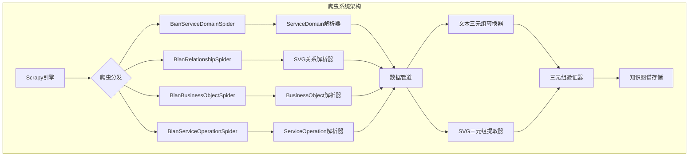
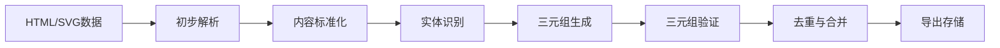

# BIAN 知识图谱爬虫 - 需求分析与设计文档

**版本:** 1.0 (初始设计版本)
**日期:** 2025年5月20日

---

## 1. 爬虫目标与定位

本爬虫系统是GraphRAG模块的关键组成部分，专门负责从BIAN官方网站抓取结构化数据，用于构建BIAN领域知识图谱。通过提取服务域定义、关系、业务对象和服务操作等内容，为图数据库提供高质量的三元组数据源。

**核心目标:**

* **全面覆盖**: 抓取BIAN 12.0服务景观中的全部服务域及其关系
* **结构提取**: 从HTML、SVG和JSON中提取实体与关系的结构化数据
* **三元组生成**: 自动化生成知识图谱所需的三元组 (主体-关系-客体)
* **可扩展性**: 支持增量抓取和更新，适应BIAN框架的迭代
* **质量保证**: 实现数据验证与清洗，确保三元组的准确性

---

## 2. 数据源分析

BIAN网站包含多种类型的页面和内容格式，需要针对不同来源采用不同的抓取策略：

### 2.1 核心数据来源

| 数据来源类型 | URL模式 | 包含内容 | 抽取难度 |
|------------|--------|---------|---------|
| 服务景观概览页 | `bian.org/servicelandscape-12-0-0/views.html` | 服务域分类与组织 | 中等 |
| 服务域详情页 | `bian.org/servicelandscape-12-0-0/object_*.html` | 服务域定义、功能、业务对象 | 中等 |
| 关系视图页 | `bian.org/servicelandscape-12-0-0/views/view_*.html` | 服务域间关系与交互 | 高 |
| SVG图表 | 嵌入在HTML页面中的`<svg>`元素 | 服务域关系的可视化表示 | 高 |
| 业务对象页 | `bian.org/servicelandscape-12-0-0/businessobjects*.html` | 业务对象定义和属性 | 中等 |

### 2.2 页面结构特点

1. **服务域详情页**:
   * 包含结构化的定义、描述、功能特性段落
   * 通常有标准化的章节标题
   * 包含业务对象和服务操作列表

2. **关系视图页**:
   * 包含复杂的SVG图表
   * SVG元素中嵌入了关系元数据(如`bizzid`, `bizzsemantic`)
   * 连接线表达了服务域间的关系类型

3. **SVG图表分析**:
   * 节点通常代表服务域或业务对象
   * 连接线代表关系，不同颜色和类型表示不同关系
   * 文本元素包含关键的命名和描述

---

## 3. 爬虫架构设计

### 3.1 多Spider设计

采用多Spider架构，每个Spider负责特定类型内容的抓取：



### 3.2 爬虫组件定义

1. **BianServiceDomainSpider**:
   * 负责服务域详情页抓取
   * 提取服务域基本信息、定义、功能和分类

2. **BianRelationshipSpider**:
   * 负责关系视图页抓取
   * 提取SVG图表和服务域间关系

3. **BianBusinessObjectSpider**:
   * 负责业务对象页面抓取
   * 提取业务对象定义、属性和关系

4. **BianServiceOperationSpider**:
   * 负责服务操作页面抓取
   * 提取服务操作定义、输入输出和行为描述

5. **共享组件**:
   * URL规范化和去重
   * 请求队列优先级管理
   * 断点续传和增量更新

---

## 4. 数据提取策略

### 4.1 HTML内容提取

使用XPath和CSS选择器从HTML页面中提取结构化内容：

```python
# 服务域详情提取示例
def parse_service_domain(self, response):
    service_domain = {
        'name': response.css('h1.domain-title::text').get(),
        'description': response.css('div.domain-description p::text').getall(),
        'category': response.css('span.domain-category::text').get(),
        'business_objects': response.css('ul.business-objects li::text').getall(),
        'service_operations': response.css('ul.service-operations li::text').getall(),
    }
    yield service_domain
```

### 4.2 SVG图表解析

使用lxml解析SVG并提取关系数据：

```python
def extract_svg_relationships(self, svg_content):
    root = etree.fromstring(svg_content)
    relationships = []
    
    # 提取节点（服务域）
    nodes = root.xpath('.//svg:g[contains(@class, "node")]', namespaces={'svg': SVG_NS})
    node_mapping = {}
    
    for node in nodes:
        node_id = node.get('id')
        text_element = node.xpath('.//svg:text/text()', namespaces={'svg': SVG_NS})
        if text_element:
            node_name = text_element[0]
            node_mapping[node_id] = node_name
    
    # 提取边（关系）
    edges = root.xpath('.//svg:g[contains(@class, "edge")]', namespaces={'svg': SVG_NS})
    
    for edge in edges:
        source_target = edge.get('id', '').split('->')
        if len(source_target) == 2:
            source_id, target_id = source_target
            if source_id in node_mapping and target_id in node_mapping:
                # 尝试提取关系类型
                edge_label = edge.xpath('.//svg:text/text()', namespaces={'svg': SVG_NS})
                rel_type = edge_label[0] if edge_label else "RELATED_TO"
                
                relationships.append({
                    'source': node_mapping[source_id],
                    'relation': rel_type,
                    'target': node_mapping[target_id]
                })
    
    return relationships
```

### 4.3 服务域标准化映射

建立服务域名称的标准化映射，解决不一致命名问题：

```python
DOMAIN_NAME_MAPPING = {
    "Contact Center Management": "联络中心管理",
    "Contact Center Operations": "联络中心管理",
    "Contact Center": "联络中心管理",
    # 更多映射...
}

def standardize_domain_name(self, name):
    return DOMAIN_NAME_MAPPING.get(name, name)
```

---

## 5. 三元组生成策略

### 5.1 基于规则的三元组提取

针对明确结构的内容，使用规则直接生成三元组：

```python
def generate_service_domain_triples(self, domain_data):
    triples = []
    domain_name = domain_data['name']
    
    # 生成类型三元组
    triples.append((domain_name, "IS_A", "ServiceDomain"))
    
    # 生成分类三元组
    if domain_data['category']:
        triples.append((domain_name, "HAS_CATEGORY", domain_data['category']))
    
    # 生成业务对象三元组
    for business_object in domain_data['business_objects']:
        triples.append((domain_name, "MANAGES", business_object))
        triples.append((business_object, "IS_A", "BusinessObject"))
    
    # 生成服务操作三元组
    for service_operation in domain_data['service_operations']:
        triples.append((domain_name, "PROVIDES", service_operation))
        triples.append((service_operation, "IS_A", "ServiceOperation"))
    
    return triples
```

### 5.2 LLM辅助三元组提取

针对非结构化文本描述，使用LLM辅助提取三元组：

```python
async def extract_triples_with_llm(self, text, domain_context):
    prompt = f"""
    Extract knowledge triples (subject, relation, object) from the following BIAN service domain description.
    Only extract factual relationships. Format each triple on a new line as: (subject, relation, object)
    
    Service Domain Context: {domain_context}
    
    Text:
    {text}
    
    Relations must be one of: IS_A, PART_OF, MANAGES, PROVIDES, INTERACTS_WITH, ASSOCIATED_WITH, AGGREGATED_BY, GETS_INPUT_FROM, REALIZED_BY

    Example: (联络中心管理, MANAGES, 客户互动)
    """
    
    # 调用LLM API (如Gemini)
    response = await call_llm_api(prompt)
    
    # 解析响应中的三元组
    triples = []
    for line in response.strip().split('\n'):
        if line.startswith('(') and line.endswith(')'):
            triple_text = line[1:-1]  # 移除括号
            parts = triple_text.split(',')
            if len(parts) == 3:
                subject = parts[0].strip()
                relation = parts[1].strip()
                obj = parts[2].strip()
                triples.append((subject, relation, obj))
    
    return triples
```

### 5.3 SVG图表关系提取

从SVG图表中提取服务域关系三元组：

```python
def extract_relationship_triples_from_svg(self, svg_relationships):
    triples = []
    for rel in svg_relationships:
        source = self.standardize_domain_name(rel['source'])
        target = self.standardize_domain_name(rel['target'])
        relation = self.map_relation_type(rel['relation'])
        
        triples.append((source, relation, target))
    
    return triples

def map_relation_type(self, raw_relation):
    relation_mapping = {
        "uses": "GETS_INPUT_FROM",
        "calls": "INTERACTS_WITH",
        "consists of": "AGGREGATED_BY",
        "part of": "IS_PART_OF",
        "related to": "ASSOCIATED_WITH",
        # 更多映射...
    }
    
    for key, value in relation_mapping.items():
        if key.lower() in raw_relation.lower():
            return value
    
    return "ASSOCIATED_WITH"  # 默认关系类型
```

---

## 6. 数据处理管道

### 6.1 多阶段处理流程



### 6.2 数据管道实现

```python
class BianKnowledgeGraphPipeline:
    def __init__(self):
        self.service_domains = set()
        self.business_objects = set()
        self.service_operations = set()
        self.triples = set()
        
    def process_item(self, item, spider):
        if spider.name == 'bian_service_domain':
            return self.process_service_domain(item)
        elif spider.name == 'bian_relationship':
            return self.process_relationship(item)
        # 处理其他spider...
        return item
    
    def process_service_domain(self, item):
        # 标准化处理
        item['name'] = self.standardize_name(item['name'])
        
        # 添加到实体集合
        self.service_domains.add(item['name'])
        
        # 生成基础三元组
        domain_triples = self.generate_domain_triples(item)
        for triple in domain_triples:
            self.triples.add(triple)
        
        # 处理描述文本
        if 'description' in item:
            text_triples = self.extract_triples_from_text(
                item['description'], 
                {'domain': item['name']}
            )
            for triple in text_triples:
                self.triples.add(triple)
        
        return item
    
    def close_spider(self, spider):
        # 导出所有收集的三元组
        self.export_triples()
```

### 6.3 三元组验证规则

```python
def validate_triple(self, triple):
    subject, relation, obj = triple
    
    # 规则1: 主体和客体不能为空
    if not subject or not obj:
        return False
    
    # 规则2: 关系必须是预定义类型
    valid_relations = {
        "IS_A", "PART_OF", "MANAGES", "PROVIDES", "INTERACTS_WITH", 
        "ASSOCIATED_WITH", "AGGREGATED_BY", "GETS_INPUT_FROM", "REALIZED_BY"
    }
    if relation not in valid_relations:
        return False
    
    # 规则3: 特定关系的主体和客体类型限制
    if relation == "MANAGES" and subject not in self.service_domains:
        return False
    
    # 规则4: 防止自我循环
    if subject == obj:
        return False
    
    # 规则5: 检查与已知实体的一致性
    if relation == "IS_A" and obj == "ServiceDomain":
        if subject not in self.service_domains:
            self.service_domains.add(subject)  # 自动添加
    
    return True
```

---

## 7. 技术栈与依赖

### 7.1 核心技术组件

| 组件 | 用途 | 选型理由 |
|-----|------|---------|
| Scrapy | 爬虫框架 | 高性能、可扩展的分布式爬虫框架 |
| Playwright | 浏览器自动化 | 处理动态加载的JavaScript内容 |
| lxml | XML/HTML解析 | 高效解析HTML和SVG内容 |
| aiohttp | 异步HTTP | 用于LLM API调用 |
| Gemini API | 三元组提取 | 高质量文本到三元组转换 |
| NetworkX | 图分析 | 用于三元组验证和关系分析 |
| NebulaGraph客户端 | 图数据库接口 | 将三元组导入NebulaGraph |

### 7.2 项目依赖

```text
# requirements.txt
Scrapy>=2.7.0
scrapy-playwright>=0.0.26
playwright>=1.30.0
lxml>=4.9.2
aiohttp>=3.8.4
networkx>=3.0
nebula3-python>=3.4.0
python-dotenv>=1.0.0
pydantic>=2.0.0
google-generativeai>=0.3.0
```

---

## 8. 项目结构

```
graphScrapy/
│
├── scrapy.cfg                 # Scrapy配置文件
│
├── bian_kg_builder/          # 项目主包
│   ├── __init__.py
│   ├── settings.py           # 爬虫设置
│   ├── middlewares.py        # 中间件
│   │
│   ├── spiders/              # 爬虫实现
│   │   ├── __init__.py
│   │   ├── service_domain_spider.py   # 服务域爬虫
│   │   ├── relationship_spider.py     # 关系爬虫
│   │   ├── business_object_spider.py  # 业务对象爬虫
│   │   └── service_operation_spider.py # 服务操作爬虫
│   │
│   ├── pipelines/            # 数据处理管道
│   │   ├── __init__.py
│   │   ├── base_pipeline.py  # 基础管道
│   │   ├── triple_pipeline.py # 三元组生成管道
│   │   └── graph_export_pipeline.py  # 图导出管道
│   │
│   ├── utils/                # 工具函数
│   │   ├── __init__.py
│   │   ├── svg_parser.py     # SVG解析工具
│   │   ├── text_processor.py # 文本处理工具
│   │   ├── llm_client.py     # LLM API客户端
│   │   └── nebula_client.py  # NebulaGraph客户端
│   │
│   └── data/                 # 数据资源
│       ├── domain_mapping.json    # 服务域映射
│       ├── relation_mapping.json  # 关系类型映射
│       └── schema_definition.json # 图谱模式定义
│
├── scripts/                  # 辅助脚本
│   ├── run_spiders.py        # 运行爬虫脚本
│   ├── validate_triples.py   # 验证三元组脚本
│   └── import_to_nebula.py   # 导入NebulaGraph脚本
│
├── tests/                    # 测试
│   ├── __init__.py
│   ├── test_spiders.py
│   ├── test_pipelines.py
│   └── test_utils.py
│
└── output/                   # 输出目录
    ├── triples/              # 三元组输出
    ├── logs/                 # 日志输出
    └── stats/                # 统计信息
```

---

## 9. 爬虫配置与运行

### 9.1 基本配置

```python
# settings.py
BOT_NAME = 'bian_kg_builder'

SPIDER_MODULES = ['bian_kg_builder.spiders']
NEWSPIDER_MODULE = 'bian_kg_builder.spiders'

# 遵循robots.txt规则
ROBOTSTXT_OBEY = True

# 配置并发和延迟
CONCURRENT_REQUESTS = 8
DOWNLOAD_DELAY = 1.5

# 启用Playwright
DOWNLOAD_HANDLERS = {
    "http": "scrapy_playwright.handler.ScrapyPlaywrightDownloadHandler",
    "https": "scrapy_playwright.handler.ScrapyPlaywrightDownloadHandler",
}

TWISTED_REACTOR = "twisted.internet.asyncioreactor.AsyncioSelectorReactor"

# 配置数据管道
ITEM_PIPELINES = {
    'bian_kg_builder.pipelines.base_pipeline.BasePipeline': 300,
    'bian_kg_builder.pipelines.triple_pipeline.TriplePipeline': 400,
    'bian_kg_builder.pipelines.graph_export_pipeline.GraphExportPipeline': 500,
}

# LLM API配置从环境变量加载
from dotenv import load_dotenv
load_dotenv()

# 输出设置
FEED_FORMAT = 'jsonlines'
FEED_URI = 'output/%(spider)s/%(time)s.jsonl'
```

### 9.2 运行爬虫

```bash
# 单独运行服务域爬虫
scrapy crawl bian_service_domain

# 单独运行关系爬虫
scrapy crawl bian_relationship

# 运行所有爬虫并生成三元组
python scripts/run_spiders.py --all

# 运行爬虫并导入NebulaGraph
python scripts/run_spiders.py --all --import-nebula
```

---

## 10. 数据质量与监控

### 10.1 数据质量指标

* **覆盖率**: BIAN服务域覆盖百分比 (目标 >95%)
* **完整性**: 每个服务域的关系平均数 (目标 >5)
* **准确率**: 三元组验证通过率 (目标 >90%)
* **一致性**: 命名和关系类型标准化率 (目标 >95%)

### 10.2 监控与警报

```python
# 在pipeline中实现监控逻辑
def process_item(self, item, spider):
    # 处理item...
    
    # 更新统计信息
    self.stats.inc_value(f'{spider.name}_items_processed')
    
    # 记录实体覆盖
    if 'name' in item and item['type'] == 'service_domain':
        self.stats.inc_value('service_domains_found')
    
    # 检查数据质量
    if not self.validate_item(item):
        self.stats.inc_value('invalid_items')
        # 记录验证失败的详细信息
        logger.warning(f"Invalid item: {item}")
    
    return item

def close_spider(self, spider):
    # 计算统计指标
    domains_found = self.stats.get_value('service_domains_found', 0)
    domains_target = 296  # BIAN 12.0中的服务域总数
    coverage = (domains_found / domains_target) * 100
    
    # 记录最终统计
    self.stats.set_value('domain_coverage_percent', coverage)
    
    # 检查是否达到质量目标
    if coverage < 90:
        logger.error(f"Domain coverage below target: {coverage}% (target: 90%+)")
```

---

## 11. 整合与扩展

### 11.1 与GraphRAG集成

爬虫系统将生成的三元组数据导入NebulaGraph，由GraphRAG模块直接访问：

```python
# import_to_nebula.py
def import_triples_to_nebula(triples_file, nebula_config):
    client = NebulaClient(nebula_config)
    
    # 创建图空间和标签（如果不存在）
    client.init_schema()
    
    # 批量导入三元组
    with open(triples_file, 'r') as f:
        triples = json.load(f)
        
        # 首先创建所有节点
        for triple in triples:
            subject, relation, obj = triple
            client.create_vertex("Entity", subject)
            client.create_vertex("Entity", obj)
        
        # 然后创建所有边
        for triple in triples:
            subject, relation, obj = triple
            client.create_edge(relation, subject, obj)
    
    # 构建索引
    client.build_indexes()
    
    # 返回导入统计
    return {
        "vertices_created": client.stats["vertices_created"],
        "edges_created": client.stats["edges_created"]
    }
```

### 11.2 增量更新机制

支持增量抓取和更新现有知识图谱：

```python
class IncrementalUpdatePipeline:
    def __init__(self, nebula_config):
        self.nebula_client = NebulaClient(nebula_config)
        self.existing_triples = set()
        self.new_triples = set()
        self.updated_triples = set()
    
    def open_spider(self, spider):
        # 加载现有三元组
        self.existing_triples = set(self.nebula_client.get_all_triples())
    
    def process_item(self, item, spider):
        # 从item生成三元组
        triples = self.generate_triples(item)
        
        for triple in triples:
            if triple not in self.existing_triples:
                self.new_triples.add(triple)
        
        return item
    
    def close_spider(self, spider):
        # 仅导入新的三元组
        for triple in self.new_triples:
            subject, relation, obj = triple
            self.nebula_client.create_edge(relation, subject, obj)
        
        # 记录更新统计
        logger.info(f"Added {len(self.new_triples)} new triples to knowledge graph")
```

---

## 12. 部署与运行计划

1. **开发阶段**: 配置环境并验证单个爬虫功能
2. **测试阶段**: 小规模抓取并验证数据质量
3. **初始部署**: 运行全量抓取创建基础知识图谱
4. **持续更新**: 定期增量更新以适应BIAN框架变化

**初始部署步骤**:

```bash
# 1. 配置环境
pip install -r requirements.txt
playwright install

# 2. 配置环境变量
cp .env.example .env
# 编辑.env添加必要的API密钥和设置

# 3. 运行全量抓取
python scripts/run_spiders.py --all --output-dir=./output

# 4. 验证三元组质量
python scripts/validate_triples.py --input=./output/triples.json

# 5. 导入NebulaGraph
python scripts/import_to_nebula.py --input=./output/triples.json
```

---

## 13. 成功标准

* **数据量**: 构建包含300+服务域、1000+业务对象的知识图谱
* **关系丰富度**: 平均每个服务域有8+个关系连接
* **准确性**: 随机抽样验证的三元组准确率>90%
* **实用性**: 能够回答BIAN架构中的复杂结构化查询
* **可扩展性**: 支持增量更新和BIAN新版本适配
