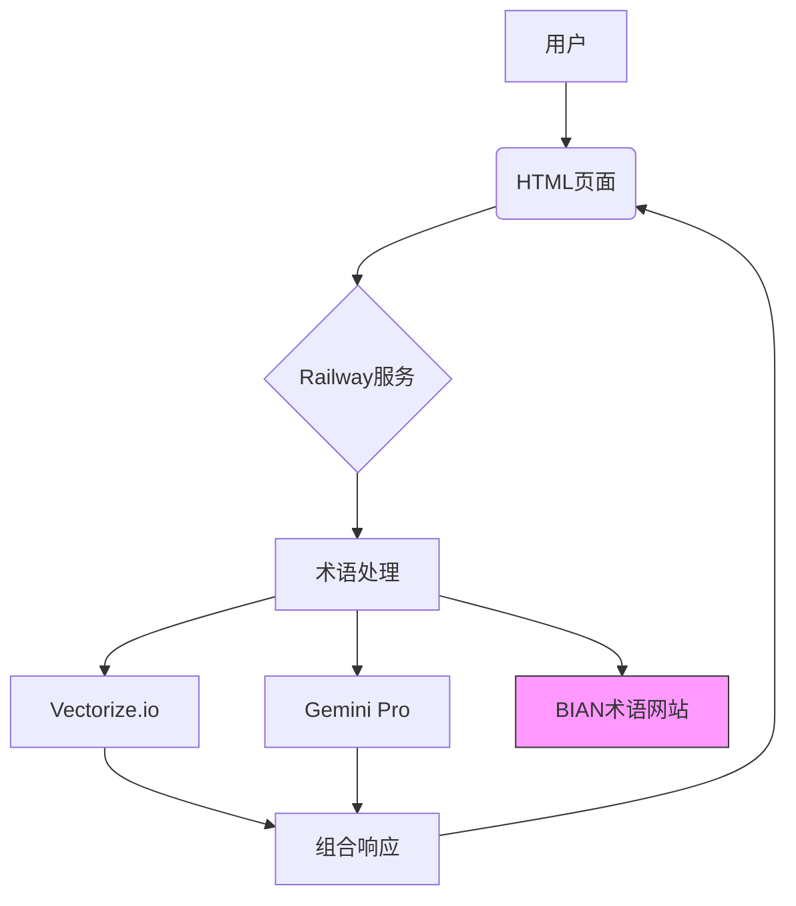
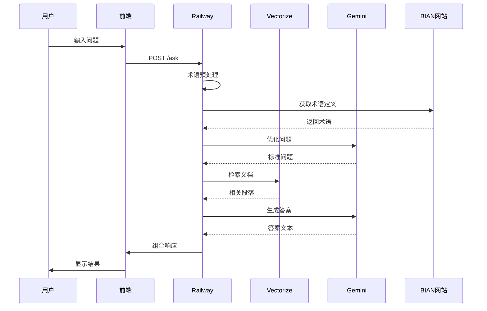
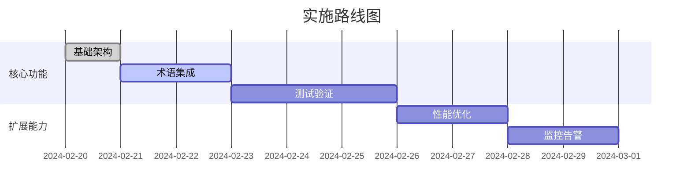

# AI_BIAN 极简问答系统

## 架构设计


## 核心数据流


## 功能矩阵
| 模块        | 职责                      | 技术方案                | 响应目标 |
|-------------|--------------------------|-----------------------|--------|
| 前端        | 问题输入/结果显示          | 静态HTML              | <1s    |
| Railway服务 | 流程协调                  | Node.js单文件         | <300ms |
| 术语处理    | 问题标准化                | 术语缓存+Gemini优化    | <200ms |
| 检索        | 文档匹配                  | Vectorize.io RAG      | <1s    |
| 生成        | 答案生成                  | Gemini Pro            | <1.5s  |

## 部署清单
```text
1. 前端托管: Railway静态托管
2. 服务文件: server.js (包含以下处理)
   ├─ 术语预处理
   ├─ 问答流程
   └─ 错误处理
3. 环境变量:
   ├─ GEMINI_KEY
   ├─ VECTORIZE_KEY
   └─ TERM_CACHE_KEY
```

## 演进路线


## 项目功能说明
本项目是一个集成了RAG（Retrieval-Augmented Generation）管线的问答系统，主要功能包括：

1. **用户输入与结果显示**：用户通过前端界面输入问题，系统将返回相应的答案。
2. **术语处理**：系统会对用户输入的问题进行术语标准化处理，以提高检索的准确性。
3. **文档检索**：通过Vectorize.io API，系统能够从相关文档中检索信息。
4. **答案生成**：使用Gemini Pro生成最终的答案，并将其返回给用户。
5. **错误处理**：系统具备完善的错误处理机制，确保在出现问题时能够给出友好的提示。

该版本实现：
✅ 最小核心功能：问答+术语处理  
✅ 单文件服务架构  
✅ 三方服务集成（Gemini+Vectorize+Railway）  
✅ 自动术语更新 